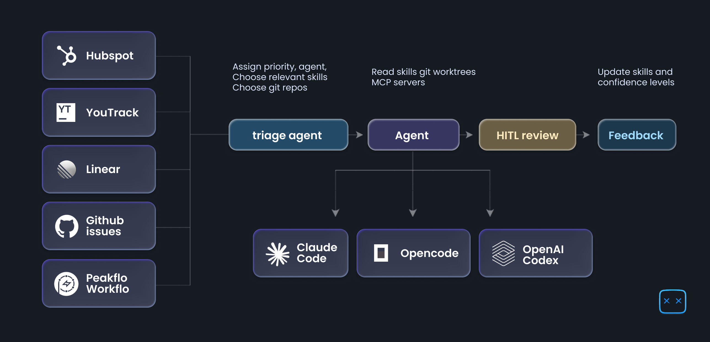
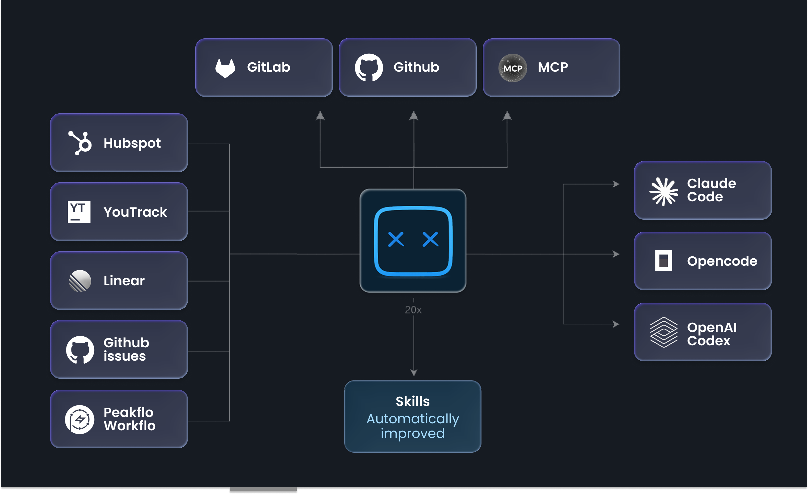

<p align="center">
  
</p>

# 20x

[](./LICENSE)
[](./package.json)
[](.)
[](https://discord.gg/fUVsqTWDxX)

**One app. All your tasks. Powered by AI agents.**

20x is a desktop app that turns your task list into an AI-powered workforce. Connect your tools — Linear, HubSpot, Peakflo — assign tasks to AI agents, and watch them work in real time.

**No cloud. No subscriptions. Everything runs on your machine.**

<p align="center">
  
</p>

## Why 20x?

Most AI tools make you copy-paste context between tabs. 20x flips it: **your tasks come to the agents, not the other way around.**

- Pull a task from Linear → AI agent picks it up, reads the context, writes the code, opens a PR
- Got a backlog of tickets? → Queue them up, agents work through them while you review
- Need human approval? → Agents pause and ask before doing anything risky

## How It Works

<p align="center">
  
</p>

1. **Tasks flow in** — from Task sources (Linear, Hubspot, Github, Workflo) or created manually
2. **Triage agent** — Assigns Coding agent (Claude Code, OpenCode, or Codex), relevant skills
3. **Agent works the task** — with live streaming output, Questions and HITL support 
4. **You stay in control** — approve, review, merge
5. **Feedback loop** — Agent creates updates the skills after task is completed

## Features

<p align="center">
  
</p>

### 🤖 Multi-Agent Support
- **Claude Code** — Anthropic's official agent SDK
- **OpenCode** — Open-source coding agent
- **Codex** — Zed Industries' agent framework
- **Live transcripts** — Watch agents think and work in real time
- **Human-in-the-loop** — Approve risky actions before execution

### 🔗 Smart Integrations
- **Linear** — Pull issues, update status, post comments
- **HubSpot** — Sync tickets and workflows
- **Peakflo** — Connect your Peakflo tasks
- **OAuth built-in** — Secure authentication flows

### 🧠 Skills System
- **Reusable instructions** — Create skill templates for common patterns
- **Auto-learning** — Agents update skills based on feedback
- **Confidence tracking** — Skills improve over time

### 🛠 Developer-First
- **Git worktree management** — Isolated branches per task
- **Repository context** — Agents know which repos to work on
- **MCP servers** — Connect Model Context Protocol tools
- **Local-first** — SQLite database, no cloud required

### 📋 Task Management
- **Recurring tasks** — Daily, weekly, monthly schedules
- **Rich metadata** — Types, priorities, due dates, labels
- **File attachments** — Add context files to tasks
- **Output fields** — Structured task results
- **Smart search** — Find anything fast

## Getting Started

### Prerequisites

- **Node.js** >= 22
- **pnpm** >= 9
- **Git** (for worktree features)
- **GitHub CLI** (optional, for repo features)

### Installation

```bash
# Clone the repository
git clone https://github.com/peakflo/20x.git
cd 20x

# Install dependencies
pnpm install
```

### macOS: Opening the App (Release Build)

macOS may block the app since it's not signed with an Apple Developer certificate. To open it, use one of these methods:

**Option A:** Right-click the app in `/Applications` and select **Open**, then confirm in the dialog.

**Option B:** Run in Terminal:
```bash
sudo xattr -cr /Applications/20x.app
```
Then open the app normally.

> This is not required if you build from source and run with `pnpm dev`.

### Configuration

**API Keys:**
Configure in Agent Settings:
- Anthropic API key for Claude Code
- OpenAI API key for OpenCode (if needed)

**Database:**
- Stored at `~/Library/Application Support/pf-desktop/pf-desktop.db` (macOS)
- Automatic backups before migrations

**Integrations:**
1. Get OAuth credentials from Linear/HubSpot/Peakflo
2. Configure in Integrations settings
3. Complete OAuth flow in-app

### Development

```bash
# Start dev server
pnpm run dev

# Run tests
pnpm test

# Build for distribution
pnpm run build:mac    # macOS
```

## Architecture

### Data Flow

```
React UI → Zustand Store → IPC Client → Preload Bridge → Main Process → SQLite
```

- **Renderer** — React 19 + Tailwind CSS 4 + Zustand 5
- **Main Process** — Electron 34 + SQLite + Agent orchestration
- **Security** — Full context isolation, no Node.js in renderer

### Agent Architecture

**Session Lifecycle:**
1. **Start** — Agent assigned, skills applied, session created
2. **Streaming** — Real-time output sent to UI
3. **Approval** — Agent pauses for human decisions
4. **Completion** — Results saved, task updated

See [AGENTS.md](./AGENTS.md) for detailed architecture.

## Tech Stack

| Layer | Technology |
|-------|-----------|
| Shell | Electron 34 |
| Build | electron-vite |
| Frontend | React 19 + Tailwind CSS 4 + Zustand 5 |
| UI Components | Radix UI primitives |
| Styling | cva + Tailwind CSS tokens |
| Icons | Lucide React |
| Font | Geist |
| Database | SQLite (better-sqlite3, WAL mode) |
| Agent SDKs | @opencode-ai/sdk, @anthropic-ai/claude-agent-sdk, @zed-industries/codex-acp |
| Testing | Vitest + happy-dom |

## Contributing

We welcome contributions! Here's how:

1. **Fork** the repo
2. **Create a branch**: `git checkout -b feature/my-feature`
3. **Write code**: Follow TypeScript strict mode, ESLint, Prettier
4. **Add tests**: Vitest tests for new features
5. **Commit**: Use conventional commits (`feat:`, `fix:`, etc.)
6. **Push**: `git push origin feature/my-feature`
7. **Open PR**: Describe changes, ensure CI passes

### Code Style
- TypeScript strict mode
- Minimal Tailwind classes (prefer CSS variables)
- Use `pnpm` (not npm)
- Check `MEMORY.md` for project patterns

## Community

- **Issues**: [GitHub Issues](https://github.com/peakflo/20x/issues)
- **Discord**: https://discord.gg/fUVsqTWDxX

## Security

### Local-First
- All data stored locally in SQLite
- No cloud sync, no subscriptions
- Optional database encryption

### OAuth & API Keys
- Tokens encrypted with Electron `safeStorage`
- Keys never exposed to renderer process
- Parameterized SQL queries only

### Electron Security
- `contextIsolation: true`
- `nodeIntegration: false`
- External links open in system browser

## Roadmap

### Planned
- Additional integrations (Jira, Asana, GitHub Issues, Notion)
- Team collaboration (shared task sources)
- Cost tracking (token usage per session)
- Agent templates (pre-configured profiles)
- Plugin marketplace (community skills)
- Desktop notifications
- Light theme

### Recently Shipped
- ✅ Multi-agent support (OpenCode, Claude Code, Codex)
- ✅ Skills system with auto-learning
- ✅ Recurring tasks
- ✅ Linear, HubSpot, Peakflo integrations
- ✅ MCP server management
- ✅ Git worktree management

## License

[MIT](./LICENSE) © 2026 Peakflo

---

Built with [Electron](https://electronjs.org), [React](https://react.dev), and [Anthropic Claude](https://anthropic.com).
